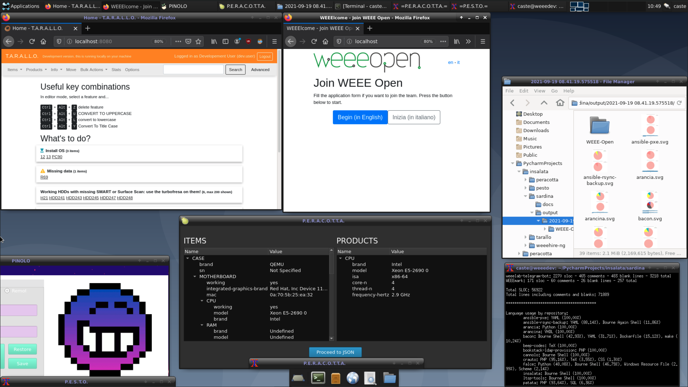

# 🥗 IN.S.A.L.A.T.A. 🥗
INstallatore Sopraffino Automatizzato della Lista di Applicativi dal Team Architettati

## What

Scripts to set up and tear down all demo software of team WEEE Open.
- `cucchiaio.sh` (Italian for spoon) installs all the needed dependencies and automatically launches all that is needed to demo our software
- `forchetta.sh` (Italian for fork) gracefully tears down everything, keeping the dependencies for future runs

Since insalata is Italian for salad, the meaning is: we prepare and mix the salad with a spoon, then we eat it with a fork.

## Why

During the 2020 pandemic we needed a way to show our software remotely, so we made the [SoftWEEEre](https://github.com/weee-open/softweeere).  
Now we need a way to demo our software at live faires, so the easiest way is just to install everything on a physical machine in a repeatable way and take it with us.

## Pics or it didn't happen

This is the final result after running `cucchiaio.sh`:

